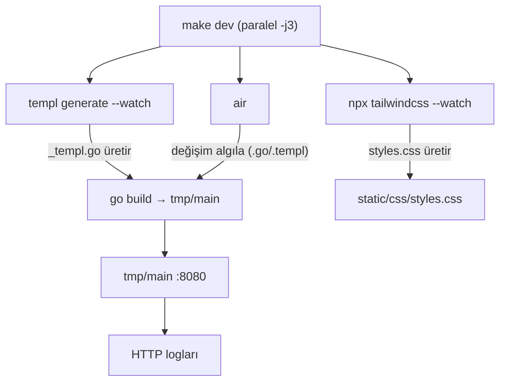

# DevTooling

**Özet:** Geliştirme ve derleme iş akışını `Makefile` ve `.air.toml` üzerinden yönetir. `make dev` templ, Tailwind ve Air izleyicilerini paralel başlatır; `make build` üretim için optimize edilmiş binary üretir. Air, `.templ` değişikliklerinde önce templ'i derleyip sonra Go binary'sini yeniden inşa ederek hot-reload sağlar.

**Kütüphaneler/Tool'lar:** GNU Make, `a-h/templ` CLI, Tailwind CSS CLI (`@tailwindcss/cli`), `air-verse/air`, `golangci-lint`, `gofmt`.

**Bağlantılar:** [[TemplViews]] · [[StaticAssets]] · [[WebServer]] · [[Index]]

**Dosyalar:**
- `Makefile`
- `.air.toml`
- `.golangci.yml`

## Geniş açıklama

### Geliştirme akışı

- **templ watcher:** `.templ` dosyası değişince `_templ.go` kodlarını yeniden üretir (bkz. [[TemplViews]]).
- **Tailwind watcher:** `input.css` kaynağını tarayıp `styles.css` üretir (bkz. [[StaticAssets]]).
- **Air watcher:** `.go` veya `.templ` değişiminde `templ generate && go build -o ./tmp/main ./cmd/web` çalıştırıp sunucuyu yeniden başlatır.

### Makefile hedefleri

| Hedef | Komut | Amaç |
|---|---|---|
| `install` | npm + go install | Geliştirme araçlarını kurar |
| `dev` | `make -j3 templ tailwind air` | Tüm izleyicileri paralel başlatır |
| `build` | `templ generate` + `tailwind --minify` + `go build` | Production binary üretir (`./bin/main`) |
| `fmt` | `gofmt -w .` + `templ fmt .` | Formatlar |
| `lint` | `golangci-lint run ./...` | Kural ihlali taraması |
| `lint-fix` | fmt + `golangci-lint run --fix` | Otomatik düzeltme |

### Air yapılandırması (`.air.toml`)

- `cmd = "templ generate && go build -o ./tmp/main ./cmd/web"` → her derleme templ üretimiyle başlar.
- `exclude_dir`: `tmp`, `vendor`, `node_modules`, `static` (statik değişiklikler hot-reload tetiklemez).
- `include_ext`: `go`, `templ`, `html`; `exclude_regex`: `.*_templ.go` (üretilen dosyalar yeniden derleme başlatmaz).
- `stop_on_error = true` → derleme hatasında izleyici durur.
- Çıkışta `clean_on_exit` ile `tmp` temizlenir.

### Önemli noktalar

- Geliştirme binary'si `./tmp/main` içinde, production binary'si `./bin/main` içinde üretilir; bu dizinler gitignore'dadır.
- `node_modules` yalnızca Tailwind CLI için kullanılır; runtime JS bağımlılığı yoktur.
- Lint hiyerarşisi `fmt → lint → lint-fix` şeklinde önerilir; CI öncesi `lint` çalıştırılmalıdır.
