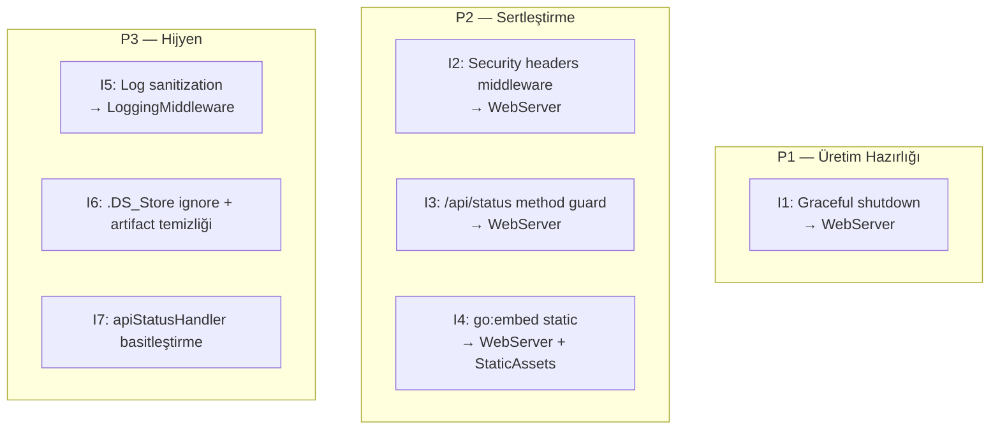

# Improvements

**Özet:** Bu node, [[Security_Audit]] denetiminden çıkan bulguların önceliklendirilmiş çözüm backlog'udur. Her madde, ilgili modül sayfasına köşeli parantez linkiyle bağlanır ve wiki seviyesinde somut uygulama önerisi içerir; kod, madde tek tek onaylanıp uygulandığında değiştirilir (AUDIT operasyonu kodu değiştirmez). Öncelikler P1 (önce) → P3 (sonra) şeklinde sıralanmıştır.

**Kütüphaneler/Standartlar:** Go standard library (`net/http`, `os/signal`, `context`, `embed`), OWASP secure headers rehberi.

**Bağlantılar:** [[Security_Audit]] · [[WebServer]] · [[LoggingMiddleware]] · [[StaticAssets]] · [[Index]]

**Dosyalar:**
- Etkilenecek dosyalar: `cmd/web/main.go`, `internal/middleware/logging.go`, `static/`

## Geniş açıklama

### Backlog görünümü



### I1 — Graceful shutdown `[HIGH]` → [[WebServer]]

`ListenAndServe` bloğu sinyal yönetimiyle sarılmalı:

```go
srv := &http.Server{ /* mevcut ayarlar */ }

ctx, stop := signal.NotifyContext(context.Background(), os.Interrupt, syscall.SIGTERM)
defer stop()

go func() {
    <-ctx.Done()
    shutdownCtx, cancel := context.WithTimeout(context.Background(), 10*time.Second)
    defer cancel()
    if err := srv.Shutdown(shutdownCtx); err != nil {
        logger.Error("Kapanma hatası", slog.String("error", err.Error()))
    }
}()

if err := srv.ListenAndServe(); err != nil && !errors.Is(err, http.ErrServerClosed) {
    logger.Error("Sunucu başlatılamadı", slog.String("error", err.Error()))
    os.Exit(1)
}
logger.Info("Sunucu düzgün kapatıldı")
```

**Etki:** Deploy/restart sırasında in-flight istekler tamamlanır; Docker/K8s `SIGTERM` akışıyla uyumlu hale gelir.

### I2 — Security headers middleware `[MEDIUM]` → [[WebServer]] — ✅ UYGULANDI (2026-08-22)

**Orijinal önerideki hata (düzeltildi):** Aşağıda ilk yazılan `script-src 'self'` CSP'si **Alpine.js'i kırar** — Alpine, `x-data="{ open: false }"` ve `@click="open = !open"` ifadelerini çalışma zamanında `new Function()` ile derler (eval eşdeğeri) ve CSP bunu yasakladığında bileşenler sessizce çalışmaz. Bu yüzden `script-src`'ye `'unsafe-eval'` eklendi; buna karşılık **inline script ve harici kaynak yasağı korunur** (klasik XSS payload'ı `<script src=evil.com>` ve inline `<script>` enjeksiyonları hâlâ engellenir).

**Uygulanan nihai çözüm** (`internal/middleware/secureheaders.go`, [[SecureHeaders]]):

```go
r.Use(middleware.SecureHeaders) // chi zincirinde en dış konum

// secureheaders.go
const cspPolicy = "default-src 'self'; " +
    "script-src 'self' 'unsafe-eval'; " +
    "style-src 'self'; img-src 'self' data:; " +
    "object-src 'none'; base-uri 'self'; frame-ancestors 'none'"

func SecureHeaders(next http.Handler) http.Handler {
    return http.HandlerFunc(func(w http.ResponseWriter, r *http.Request) {
        h := w.Header()
        h.Set("X-Content-Type-Options", "nosniff")
        h.Set("X-Frame-Options", "DENY") // modern karşılığı: frame-ancestors 'none'
        h.Set("Referrer-Policy", "strict-origin-when-cross-origin")
        h.Set("Content-Security-Policy", cspPolicy)
        next.ServeHTTP(w, r)
    })
}
```

**Kalan risk ve gelecek seçenekler:** `'unsafe-eval'` eval tabanlı sömürülere kapı aralar (dar bir zayıflık). Tamamen kapatmak için: (a) Alpine'in resmi CSP build'i (`@alpinejs/csp`) kullanılır ve ifadeler `Alpine.data()` kaydına taşınır, ya da (b) tek demo kartı için Alpine tamamen kaldırılır. Karar bir sonraki INGEST'te verilebilir.

Doğrulama: `/` ve `/api/status` yanıtlarında 4 header set; 405 yanıtlarında da mevcut (zincir en dışta).

### I3 — `/api/status` metot guard'ı `[MEDIUM]` → [[WebServer]] — ✅ KAPANDI (chi geçişiyle, 2026-08-22)

**Tarihçe:** ServeMux döneminde önce `mux.HandleFunc("GET /api/status", ...)` metot deseni denendi; catch-all `/` route'u POST isteklerini kendi altına düşürdüğü için işe yaramadı (ServeMux yalnızca hiçbir desen eşleşmezken 405 üretir; httptest deneyiyle kanıtlandı). Geçici olarak handler içi guard kullanıldı.

**Nihai durum:** Router **chi v5**'e geçirildi. chi'de metot-kayıtlı route'lar (`r.Get`) diğer metotlara otomatik `405 Method Not Allowed + Allow: GET` döndürür ve catch-all önceliği tuzağı yoktur → handler içindeki guard kaldırıldı, çözüm router seviyesine indi.

Doğrulama: GET → 200 + fragment; POST/DELETE → `405 + Allow: GET`; bilinmeyen yol → `404`.

### I4 — Statik varlıkları gömme (`go:embed`) `[MEDIUM]` → [[StaticAssets]]

CWD bağımlılığını kökten çözer ve dağıtımı tek-binary yapar:

```go
//go:embed static
var staticFS embed.FS

sub, _ := fs.Sub(staticFS, "static")
mux.Handle("/static/", http.StripPrefix("/static/", http.FileServer(http.FS(sub))))
```

Not: Embed yaklaşımı dizin listelemesini de doğal olarak kapatmaz; S3 için ayrıca özel bir handler veya listeleme kapatan sarmalayıcı gerekir. Alternatif (embed istenmezse): statik kök yolunu `-static` flag'i/env ile konfigüre et. Karar bu madde uygulandığında verilmelidir.

### I5 — Log sanitization `[LOW]` → [[LoggingMiddleware]]

User-Agent/path değerleri loglamadan önce kontrol karakterlerinden arındırılmalı:

```go
func sanitize(s string) string {
    return strings.Map(func(r rune) rune {
        if r < 0x20 || r == 0x7f { // kontrol karakterleri
            return -1
        }
        return r
    }, s)
}
```

Ayrıca S5 (IP/PII): kamuya açık dağıtımda IP'nin son octet'inin maskelenmesi ya da log retention süresinin belgelenmesi önerilir.

### I6 — Repo hijyeni `[LOW]` — ✅ KAPANDI (2026-08-22)

- [x] `.gitignore`'a `.DS_Store` eklendi.
- [x] Minified `styles.css` artifact'i karar sahibi tarafından commitlendi.

### I7 — `apiStatusHandler` basitleştirme `[LOW]` → [[WebServer]]

Fabrika fonksiyonu yerine doğrudan tanım yeterli (fragment sabit olduğundan state gerekmiyor):

```go
var apiStatusHandler = func(w http.ResponseWriter, _ *http.Request) {
    httputil.WriteHTML(w, http.StatusOK, statusFragment)
}
```

### Süreç notu

- Bu backlog'daki maddeler uygulandıkça ilgili modül sayfalarının `security_risk`/`tech_debt` alanları boşaltılır ve [[Security_Audit]] bulgu tabloları güncellenir.
- Yeni middleware eklenirse INGEST ile wiki'ye yeni node açılmalıdır.
