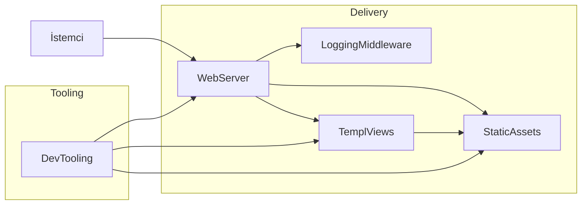
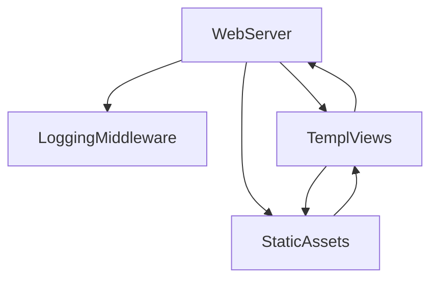
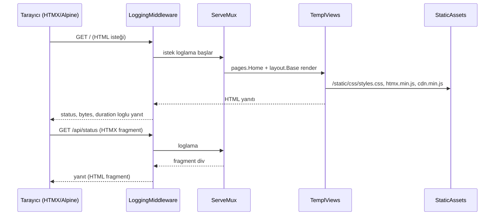

# Index

**Özet:** Bu dosya projenin Bilgi Grafiği ana haritasıdır (Knowledge Graph Index). Tüm wiki node'larını listeler, katman dağılımını gösterir ve bir isteğin istemciden yanıta kadar izlediği akışı özetler. Yeni bir modül/fikir araştırmadan önce buradan başlayın.

## Mimari Harita

## Node Listesi

### Delivery Katmanı
- [[WebServer]] — giriş noktası, `ServeMux`, route tanımları, statik servis, middleware sarmalama
- [[LoggingMiddleware]] — istek/yanıt loglama, `responseWriter` sarmalayıcı, seviye mantığı
- [[TemplViews]] — templ view katmanı: `layout.Base` iskeleti + `pages.Home` sayfası
- [[StaticAssets]] — Tailwind CSS (v4 `@source`) + HTMX/Alpine.js statik kopyaları

### Araçlar / Süreç
- [[DevTooling]] — `Makefile` (dev/build/lint) + `.air.toml` hot-reload pipeline

## Bağımlılık Grafiği

## Uçtan Uca İstek Akışı

## İnceleme Rehberi

1. Uygulamanın nereden başladığını görmek için → [[WebServer]]
2. Her isteğin nasıl loglandığını anlamak için → [[LoggingMiddleware]]
3. Sayfa render ve component hiyerarşisi için → [[TemplViews]]
4. Stillerin nasıl derlendiği için → [[StaticAssets]]
5. Geliştirme/üretim pipeline'ı için → [[DevTooling]]
