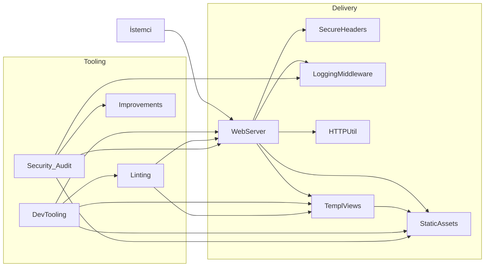
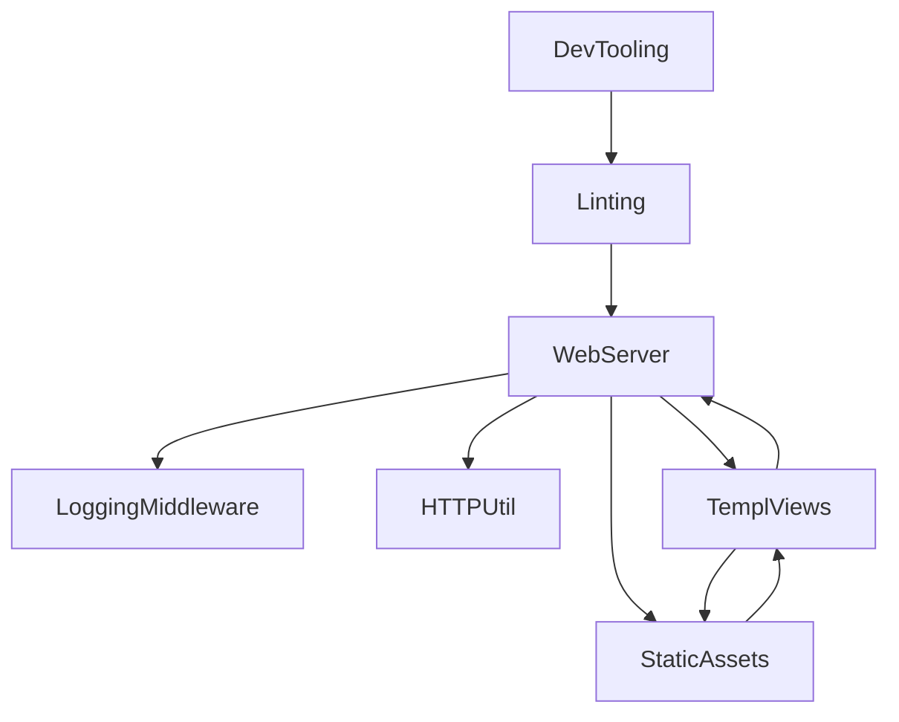
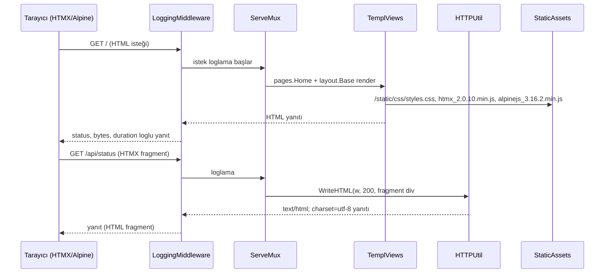

# Index

**Özet:** Bu dosya projenin Bilgi Grafiği ana haritasıdır (Knowledge Graph Index). Tüm wiki node'larını listeler, katman dağılımını gösterir ve bir isteğin istemciden yanıta kadar izlediği akışı özetler. Yeni bir modül/fikir araştırmadan önce buradan başlayın.

## Mimari Harita

## Node Listesi

### Delivery Katmanı
- [[WebServer]] — giriş noktası, chi v5 router (`r.Get` metot kayıtları → otomatik 405), `http.Server` timeout'ları, `r.Use` middleware
- [[SecureHeaders]] — tüm yanıtlara güvenlik başlıkları (CSP + nosniff + DENY + Referrer-Policy); S1 çözümü
- [[LoggingMiddleware]] — istek/yanıt loglama, `responseWriter` sarmalayıcı (WriteHeader/WriteString/Flush/Hijack/Push/Unwrap ileri taşıma), seviye mantığı
- [[HTTPUtil]] — `httputil.WriteHTML`: Content-Type + durum kodu ile HTML yanıtı yazımı, commit sonrası hata loglama
- [[TemplViews]] — templ view katmanı: `layout.Base` iskeleti + `pages.Home` sayfası
- [[StaticAssets]] — Tailwind CSS (v4 `@source`) + versiyonlu HTMX/Alpine.js statik kopyaları

### Araçlar / Süreç
- [[DevTooling]] — `Makefile` (dev/build/lint) + `.air.toml` hot-reload pipeline
- [[Linting]] — golangci-lint v2 konfigürasyonu: linter seti, ayarlar, exclusions, gofumpt/gci formatter'ları
- [[Security_Audit]] — OWASP + performans denetim raporu (2026-08-22): bulgular seviyelere göre listeli, temiz alanlar belgeli
- [[Improvements]] — denetimden çıkan önceliklendirilmiş çözüm backlog'u (P1 graceful shutdown → P3 hijyen)

## Bağımlılık Grafiği

## Uçtan Uca İstek Akışı

## İnceleme Rehberi

1. Uygulamanın nereden başladığını görmek için → [[WebServer]]
2. Yanıt güvenlik başlıkları için → [[SecureHeaders]]
3. Her isteğin nasıl loglandığını anlamak için → [[LoggingMiddleware]]
4. HTML yanıtlarının nasıl yazıldığı için → [[HTTPUtil]]
5. Sayfa render ve component hiyerarşisi için → [[TemplViews]]
6. Stillerin nasıl derlendiği için → [[StaticAssets]]
7. Geliştirme/üretim pipeline'ı için → [[DevTooling]]
8. Lint kural ve istisnaları için → [[Linting]]
9. Güvenlik/performans riskleri ve temiz alanlar için → [[Security_Audit]]
10. Risk giderme planı ve refactor sırası için → [[Improvements]]
