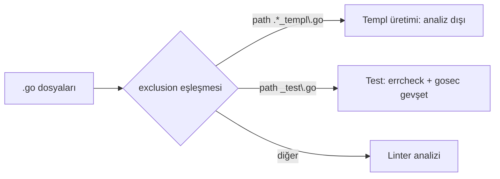
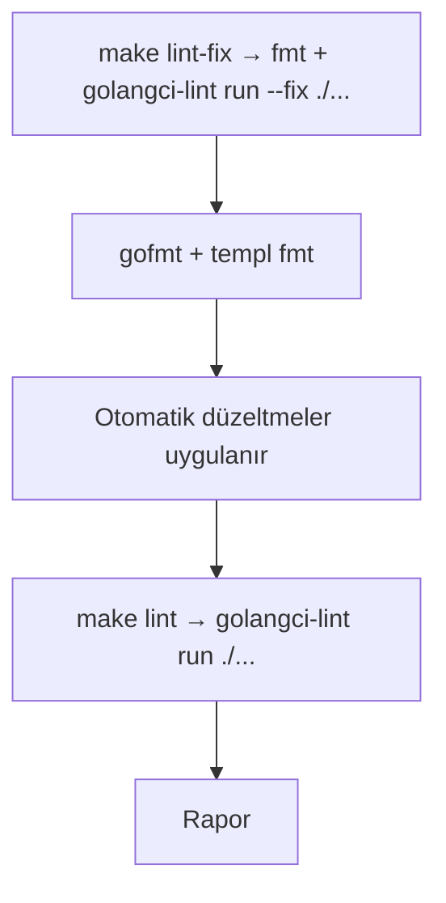

# Linting

**Özet:** `.golangci.yml` dosyası golangci-lint v2 konfigürasyonudur: `run` zaman aşımı ve mod yönetimi, aktif linter seti, linter ayarları (`settings`), Templ/üretilmiş dosyalar için istisnalar (`exclusions`) ve `gofumpt` + `gci` formatter'larını tanımlar. `Makefile` üzerinden `make lint` / `make lint-fix` ile çalıştırılır.

**Kütüphaneler/Tool'lar:** `golangci-lint` v2 (config JSON-Schema ile doğrulanır), `gofumpt`, `gci`, `gofmt`, `templ fmt`.

**Bağlantılar:** [[WebServer]] · [[TemplViews]] · [[DevTooling]] · [[Index]]

**Dosyalar:**
- `.golangci.yml`

## Geniş açıklama

Konfigürasyon `version: "2"` şemasındadır ve üç büyük bloktan oluşur: `linters`, `formatters`, `issues`.

### Linter seçimi

Varsayılan set `standard`'dır; üzerine 4 kategoriye ayrılmış linterler eklenir:

| Kategori | Linterler |
|---|---|
| Temel / hata önleyici | `errcheck`, `govet`, `ineffassign`, `staticcheck`, `unused` |
| Web & Güvenlik | `bodyclose`, `gosec`, `noctx` |
| Kod kalitesi & idiomatic Go | `gocritic`, `revive`, `copyloopvar`, `goconst`, `unconvert`, `intrange`, `errname`, `nilnil`, `perfsprint`, `usestdlibvars`, `wastedassign` |
| Log & hata yönetimi | `sloglint`, `errorlint`, `modernize` |

- `sloglint` projede yoğun kullanılan `slog` çağrılarını denetler (anahtar tekrarı, karışık argüman).
- `errorlint` `%w` sarma ve `errors.Is/As` zorunluluğu getirir.
- `modernize` modern Go dili/kütüphane deyimlerini önerir ve otomatik düzeltme (autofix) destekler.
- `unused` + `staticcheck` derleme dışı kalan sembolleri ve kalıpları yakalar.

### Linter ayarları (`settings`)

- **govet:** `enable-all: true`; yalnızca `fieldalignment` (struct bellek sıralaması) devre dışı — okunabilirliği bozmamak için.
- **gocritic:** `diagnostic`, `style`, `performance` tag'leri açık; `ifElseChain` ve `singleCaseSwitch` kontrolleri kapatılmış.
- **revive:** `severity: warning`; `exported` ve `package-comments` kuralları (yorum zorunluluğu) devre dışı.
- **goconst:** min 3 karakter, min 3 tekrar eşiği.

### İstisnalar (`exclusions`)

- `paths`: `.*_templ\.go` regex'i ile üretilen Templ dosyaları analiz dışı tutulur (kaynak `.templ` dosyaları analiz edilir).
- `rules`: test dosyalarında `errcheck`/`gosec`, `_templ.go` dosyalarında `errcheck`/`gocritic`/`revive`/`govet` istisnaları.
- Bu sayede [[WebServer]] ve [[TemplViews]] gibi kaynak kodlar katı kurallarla, üretilmiş kodlar istisnasız çalışır.

### Formatter'lar (`formatters`)

- **gofumpt:** `gofmt`'un sıkılaştırılmış hali (boş satır grupları, if-else parantezleri).
- **gci:** import bloklarını `standard → default → prefix(ozkansen.com)` sırasıyla gruplar; yerel paketler ayrı bir grupta tutulur.
- `golangci-lint run --fix` bu formatter'ları ve autofix destekleyen linterleri uygular (`make lint-fix`, bkz. [[DevTooling]]).

### Makefile entegrasyonu

### Önemli noktalar

- `config verify` ile yapılandırma JSON-Schema üzerinden doğrulanır (v1 anahtarları kaldırılmıştır: `run.skip-files`, `linters-settings`, `issues.exclude-rules` v2'de `exclusions` altına taşındı).
- `max-issues-per-linter` ve `max-same-issues` `0` yapılarak rapor sınırı kaldırılmıştır (tam rapor).
- [[WebServer]] içindeki `http.Server` timeout'ları ve `w.Write` hata kontrolü, bu yapılandırmadaki `gosec` G114 ve `errcheck` kurallarına istinaden eklendi.
