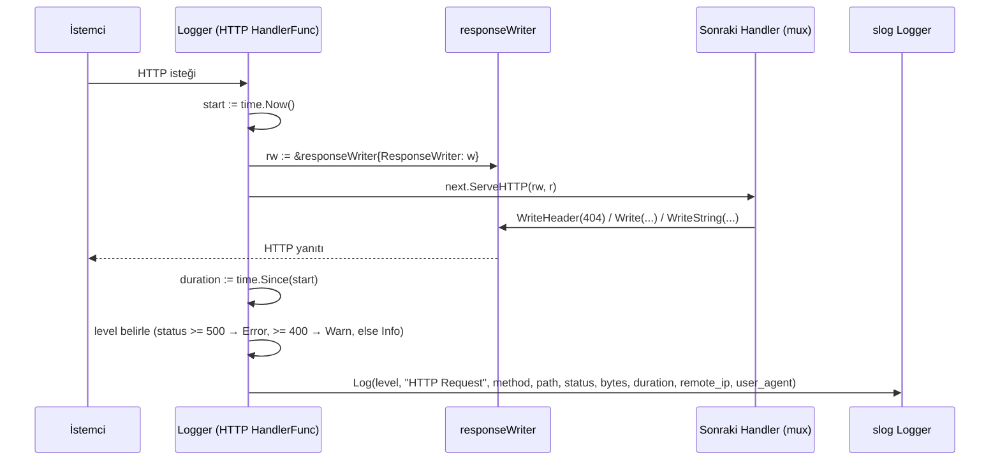

# LoggingMiddleware

**Özet:** `internal/middleware/logging.go` tüm HTTP isteklerini yakalayıp `slog` ile detaylı loglar. `responseWriter` adlı sarmalayıcı tip, `WriteHeader`/`Write`/`WriteString` çağrılarını izleyerek HTTP durum kodunu ve yazılan bayt miktarını yakalar; `Flush`/`Hijack`/`Push`/`Unwrap` arayüzlerini de temel yazıcıya ileri taşır. Log seviyesi durum koduna göre dinamik belirlenir (5xx → Error, 4xx → Warn, diğer → Info).

**Kütüphaneler:** Go standard library (`net/http`, `log/slog`, `net`, `bufio`, `io`, `errors`, `time`).

**Bağlantılar:** [[WebServer]] · [[Index]]

**Dosyalar:**
- `internal/middleware/logging.go`

## Geniş açıklama

Bu paket, Go'nun `http.Handler` desenine uyan tek bir fonksiyon (`Logger`) sunar. `Logger(logger)` çağrısı bir `func(http.Handler) http.Handler` döner; bu da [[WebServer]]'de mux'u sarmalamak için kullanılır. Sarmalanan zincir sayesinde istek/yanıt çifti tek bir noktadan izlenir.

### responseWriter sarmalayıcısı

`http.ResponseWriter` arayüzü gömülerek (embedding) yazma işlemleri kesilir:

- `WriteHeader(code)` → durum kodunu `rw.status` alanına yazar, gerçek yanıtı iletir. **Birden fazla çağrıyı yoksayar:** net/http yalnızca ilk `WriteHeader`'ı kullandığından, logun gerçek durum koduyla uyumlu kalması için burada da ilki korunur.
- `Write(b)` → eğer `status` henüz 0 ise (açıkça `WriteHeader` çağrılmadıysa) varsayılan `200 OK` atanır. Yazılan bayt sayısı `bytesWritten` üzerinden biriktirilir.
- `WriteString(s)` → `io.StringWriter` arayüzünü temel yazıcıya ileri taşır; böylece `io.WriteString` çağrıları ekstra bir `[]byte` dönüşümü olmadan geçer (örn. [[HTTPUtil]] içindeki `WriteHTML` bu yolu kullanır).

Sarmalayıcı ayrıca özel yetenek arayüzlerini de ileri taşır; yoksa davranış:

| Metot | Amaç | Desteklenmiyorsa |
|---|---|---|
| `Flush()` | SSE / streaming yanıtlar | Sessizce yok sayılır |
| `Hijack()` | WebSocket / uzun poll için bağlantı devri | Hata döner |
| `Push(target, opts)` | HTTP/2 server push | `http.ErrNotSupported` döner |
| `Unwrap()` | `http.ResponseController`'ın temel yazıcıyı bulması | — (her zaman temel yazıcıyı döner) |

Böylece sarmalanmış handler'dan sonra hangi durum koduyla ve kaç bayt ile yanıt verildiği bilinir; middleware zinciri streaming/WebSocket gibi senaryoları da bozmaz.

### Yaşam döngüsü

### Log alanları

| Alan | Kaynak | Açıklama |
|---|---|---|
| `method` | `r.Method` | HTTP metodu |
| `path` | `r.URL.Path` | İstenen yol |
| `status` | `rw.status` | Yanıt durum kodu |
| `bytes` | `rw.bytesWritten` | Yazılan bayt sayısı |
| `duration` | `time.Since(start)` | İstek süresi |
| `remote_ip` | `r.RemoteAddr` | İstemci adresi |
| `user_agent` | `r.UserAgent()` | İstemci User-Agent |

### Önemli noktalar

- Middleware, `r.Context()` üzerinden context bağlamını log çağrısına aktarır; böylece istek iptal edilirse log kaydı da iptal edilebilir.
- Varsayılan status `200` olduğundan, `WriteHeader` çağırmayan handler'lar bile doğru loglanır (`status == 0` kontrolü `Write` ve `WriteString` içinde yapılır).
- `Unwrap` metodu sayesinde `http.NewResponseController(w)`, sarmalayıcıyı aşarak temel `ResponseWriter` üzerindeki `Flusher`/`Hijacker`/`Pusher` yeteneklerini bulabilir.
- Bağımlılık tek yönlüdür: [[WebServer]] bu paketi kullanır, bu paket diğer internal modüllere bağımlı değildir.
