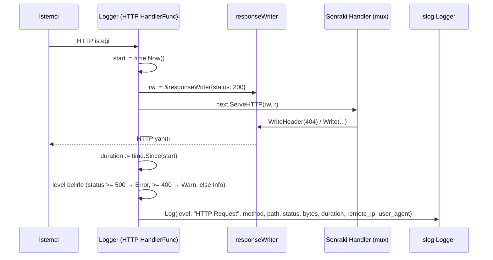

# LoggingMiddleware

**Özet:** `internal/middleware/logging.go` tüm HTTP isteklerini yakalayıp `slog` ile detaylı loglar. `responseWriter` adlı sarmalayıcı tipi, `WriteHeader`/`Write` çağrılarını izleyerek HTTP durum kodunu ve yazılan bayt miktarını yakalar. Log seviyesi durum koduna göre dinamik belirlenir (5xx → Error, 4xx → Warn, diğer → Info).

**Kütüphaneler:** Go standard library (`net/http`, `log/slog`, `time`).

**Bağlantılar:** [[WebServer]] · [[Index]]

**Dosyalar:**
- `internal/middleware/logging.go`

## Geniş açıklama

Bu paket, Go'nun `http.Handler` desenine uyan tek bir fonksiyon (`Logger`) sunar. `Logger(logger)` çağrısı bir `func(http.Handler) http.Handler` döner; bu da [[WebServer]]'de mux'u sarmalamak için kullanılır. Sarmalanan zincir sayesinde istek/yanıt çifti tek bir noktadan izlenir.

### responseWriter sarmalayıcısı

`http.ResponseWriter` arayüzü gömülerek (embedding) yazma işlemleri kesilir:

- `WriteHeader(code)` → durum kodunu `rw.status` alanına yazar, gerçek yanıtı iletir.
- `Write(b)` → eğer `status` henüz 0 ise (açıkça `WriteHeader` çağrılmadıysa) varsayılan `200 OK` atanır. Yazılan bayt sayısı `bytesWritten` üzerinden biriktirilir.

Böylece sarmalanmış handler'dan sonra hangi durum koduyla ve kaç bayt ile yanıt verildiği bilinir.

### Yaşam döngüsü

### Log alanları

| Alan | Kaynak | Açıklama |
|---|---|---|
| `method` | `r.Method` | HTTP metodu |
| `path` | `r.URL.Path` | İstenen yol |
| `status` | `rw.status` | Yanıt durum kodu |
| `bytes` | `rw.bytesWritten` | Yazılan bayt sayısı |
| `duration` | `time.Since(start)` | İstek süresi |
| `remote_ip` | `r.RemoteAddr` | İstemci adresi |
| `user_agent` | `r.UserAgent()` | İstemci User-Agent |

### Önemli noktalar

- Middleware, `r.Context()` üzerinden context bağlamını log çağrısına aktarır; böylece istek iptal edilirse log kaydı da iptal edilebilir.
- Varsayılan status `200` olduğundan, `WriteHeader` çağırmayan handler'lar bile doğru loglanır.
- Bağımlılık tek yönlüdür: [[WebServer]] bu paketi kullanır, bu paket diğer modüllere bağımlı değildir.
