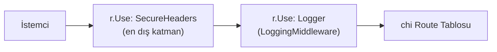

# SecureHeaders

**Özet:** `internal/middleware/secureheaders.go`, tüm HTTP yanıtlarına temel güvenlik başlıklarını ekleyen chi uyumlu middleware'dir. CSP ile kaynak yükleme beyaz listesi tanımlar; clickjacking (X-Frame-Options + frame-ancestors), MIME sniffing ve Referrer sızıntısını engeller. [[Security_Audit]]'teki S1 bulgusunun çözümüdür ([[Improvements]] I2).

**Kütüphaneler:** Go standard library (`net/http`).

**Bağlantılar:** [[WebServer]] · [[LoggingMiddleware]] · [[StaticAssets]] · [[TemplViews]] · [[Security_Audit]] · [[Index]]

**Dosyalar:**
- `internal/middleware/secureheaders.go`
- `cmd/web/main.go` (zincir bağlama noktası)

## Geniş açıklama

### Middleware zincirindeki yeri

`SecureHeaders` zincirin **ilk** `Use`'udur; böylece handler hata verse bile (404/405 dahil) her yanıt header'lı çıkar. stdlib imzasına sahiptir (`func(http.Handler) http.Handler`), bu yüzden `r.Use(middleware.SecureHeaders)` şeklinde parantezsiz geçirilir.

### Header seti ve gerekçeleri

| Header | Değer | Engellediği risk |
|---|---|---|
| Content-Security-Policy | `default-src 'self'; script-src 'self' 'unsafe-eval'; style-src 'self'; img-src 'self' data:; object-src 'none'; base-uri 'self'; frame-ancestors 'none'` | XSS payload'ları: inline `<script>` ve harici kaynak yüklemesi engellenir |
| X-Frame-Options | `DENY` | Clickjacking (eski tarayıcılar) |
| — (CSP içinde) | `frame-ancestors 'none'` | Clickjacking (modern tarayıcılar) |
| X-Content-Type-Options | `nosniff` | MIME sniffing ile içerik çalıştırma |
| Referrer-Policy | `strict-origin-when-cross-origin` | Cross-origin URL sızıntısı |

### `'unsafe-eval'` kararı

Alpine.js ([[StaticAssets]]'teki yerel kopya), `x-data="{ open: false }"` gibi ifadeleri çalışma zamanında `new Function()` ile derler — CSP terminolojisinde bu eval'dir. `'unsafe-eval'` olmadan Alpine kartı sessizce bozulur. Bu kararın bedeli eval tabanlı sömürülere karşı korumanın zayıflamasıdır; buna karşılık en yaygın vektörler (inline script, harici script kaynağı) hâlâ tamamen engellidir.

**İleride kapatmak isterseniz:**
1. `@alpinejs/csp` build'i ile değiştirip ifadeleri `Alpine.data()` kaydına taşımak, ya da
2. Tek demo kart olduğu için Alpine'i kaldırıp vanilla JS'e geçmek.

### Önemli noktalar

- HTMX'in `hx-get`/`hx-swap` akışı connect-src gerektirmez (aynı origin, `default-src 'self'` kapsamında izinli); fragment swap CSP ile çelişmez.
- Stil ve fontlar harici CDN'den gelmediği için `style-src 'self'` yeterlidir ([[TemplViews]] yalnızca yerel `styles.css` referanslar).
- Yeni bir harici kaynak eklenirse (örn. web fontu, analytics scripti) CSP'nin güncellenmesi gerekir — aksi halde tarayıcı kaynağı bloklar.
