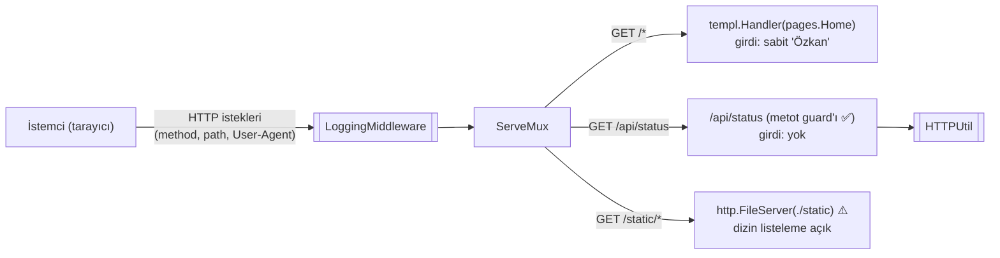
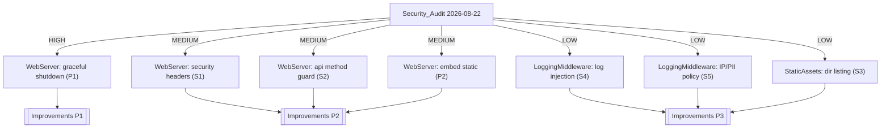

# Security_Audit

**Özet:** Bu node, codebase'in OWASP Top 10 standartları, Go backend en iyi pratikleri ve performans/stabilite metrikleri açısından tam kapsamlı denetim raporudur (denetim tarihi: 2026-08-22). Tespit edilen bulgular kritiklik seviyelerine göre listelenmiş, ilgili modül sayfalarına bağlanmış ve çözüm önerileri [[Improvements]] backlog'una aktarılmıştır. Kod tabanı genel olarak sağlıklıdır: kritik seviyede ([CRITICAL]) bulgu yoktur; en önemli boşluk üretim dağıtımına hazırlık alanındadır (graceful shutdown eksikliği).

**Kütüphaneler/Standartlar:** OWASP Top 10 (2021), Go backend best practices, `golangci-lint` güvenlik linter'ları (`gosec`, `noctx`, `bodyclose`), manuel kod incelemesi.

**Bağlantılar:** [[Improvements]] · [[WebServer]] · [[LoggingMiddleware]] · [[HTTPUtil]] · [[StaticAssets]] · [[TemplViews]] · [[Linting]] · [[Index]]

**Dosyalar (denetlenen yüzey):**
- `cmd/web/main.go`
- `internal/middleware/logging.go`
- `internal/httputil/response.go`
- `internal/views/layout/base.templ` + `internal/views/pages/home.templ`
- `static/css/*`, `static/js/*`
- `Makefile`, `.air.toml`, `.golangci.yml`, `go.mod`, `.gitignore`

## Geniş açıklama

### Tehdit yüzeyi (Threat Surface)

Uygulama küçük ve saldırı yüzeyi dardır: kullanıcı girdisi işleyen form/query parametresi yoktur, veritabanı yoktur, kimlik doğrulama yoktur. Tüm giriş noktaları aşağıdaki diyagramdadır:

### Güvenlik bulguları

| ID | Seviye | Bulgu | Modül | OWASP |
|---|---|---|---|---|
| S1 | [MEDIUM] | Güvenlik header'ları hiçbir yanıtta set edilmiyor: CSP, X-Content-Type-Options, X-Frame-Options, Referrer-Policy | [[WebServer]] | A05:Security Misconfiguration |
| S2 | [MEDIUM] ✅ Çözüldü (2026-08-22) | `/api/status` route'u metot kontrolü yapmıyordu; handler içi guard eklendi — non-GET artık `405 + Allow: GET` döner (bkz. [[Improvements]] I3) | [[WebServer]] | A01:Broken Access Control |
| S3 | [LOW] | `http.FileServer` `/static/css/` ve `/static/js/` altında dizin listelemesi sunuyor (bilinç sızması) | [[StaticAssets]] | A05:Security Misconfiguration |
| S4 | [LOW] | Log injection: `User-Agent` ve path ham haliyle loglanıyor; kontrol karakterleriyle sahte log satırı üretilebilir | [[LoggingMiddleware]] | A09:Security Logging Failures |
| S5 | [LOW] | Loglarda `remote_ip` (PII) saklanıyor; retention/anonimleştirme politikası tanımlı değil (GDPR notu) | [[LoggingMiddleware]] | A09:Security Logging Failures |

**S1 detay:** HTMX `hx-swap="outerHTML"` ile sunucudan gelen HTML'i ham olarak DOM'a basar. Şu an fragment sabit bir string olduğu için risk somutlaşmıyor; ancak ileride dinamik içerik eklendiğinde CSP olmaması XSS etki alanını büyütür. Önerilen minimum set: `Content-Security-Policy`, `X-Content-Type-Options: nosniff`, `X-Frame-Options: DENY`, `Referrer-Policy: strict-origin-when-cross-origin`. Çözüm → [[Improvements]] P2.

**S4 detay:** `tint.NewTextHandler` çıktısı tek satırlıktır; `\n`, `\r` gibi karakterler User-Agent'tan loga taşınırsa satır sahteciliği (log forging) mümkündür. `slog.String` değerini sanitize eden bir yardımcı ya da JSON handler yeterlidir.

### Performans & Stabilite bulguları

| ID | Seviye | Bulgu | Modül |
|---|---|---|---|
| P1 | [HIGH] | Graceful shutdown yok: SIGTERM/SIGINT süreci anında öldürür; in-flight istekler yarım kalır. `ListenAndServe` hatasında da `os.Exit(1)` ile ani çıkış yapılır | [[WebServer]] |
| P2 | [MEDIUM] | `http.Dir("./static")` çalışma dizinine (CWD) bağımlı: binary farklı bir dizinden çalıştırılırsa tüm statik varlıklar 404 döner | [[WebServer]] |

**P1 detay:** Reverse proxy (systemd/Docker/K8s) arkasında her yeniden deploy, aktif isteklerin kesilmesi anlamına gelir. Çözüm: `signal.NotifyContext` + `srv.Shutdown(ctx)` → [[Improvements]] P1.

### Kod Kalitesi bulguları

| ID | Seviye | Bulgu | Kapsam |
|---|---|---|---|
| Q1 | [LOW] | `apiStatusHandler()` fabrika fonksiyonu, sabit bir fragment için gereksiz dolaylama katmanı ekliyor | [[WebServer]] |
| Q2 | [LOW] ✅ Çözüldü (2026-08-22) | Repo hijyeni: `.DS_Store` `.gitignore`'a eklendi; minified `styles.css` commitlendi | repository geneli |

Karmaşıklık analizi: Tüm fonksiyonların siklomatik karmaşıklığı düşük (en yükseği `Logger` middleware'i ~5). Katman sınırları ihlal edilmemiş; delivery katmanı içi bağımlılıklar tek yönlü ve temiz ([[Index]] bağımlılık grafiğine uygun). DRY ihlali tespit edilmedi.

### Temiz bulunanlar (Clean Bill)

Denetlenen ve **sorun bulunmayan** alanlar — regresyon izlemede referans olması için:

- **Secret/token:** Repoda hiçbir secret, token, credential yok; harici servis entegrasyonu yok.
- **Enjeksiyon:** SQL/NoSQL/komut çalıştırma yok; HTML fragment sabit string (`statusFragment`) → template injection yok.
- **XSS:** templ motoru otomatik escape yapar; `pages.Home("Özkan")` girdisi derleme zamanında sabittir.
- **Concurrency:** Goroutine spawn edilmemiş, paylaşımlı state/kilit yok → sızıntı/deadlock potansiyeli yok.
- **N+1 / veritabanı:** Veritabanı erişimi yok.
- **Timeout'lar:** `http.Server` timeout seti eksiksiz (`ReadHeaderTimeout` dahil — gosec G114 uyumlu).
- **Bağımlılık sağlığı:** Yalnızca 2 direkt bağımlılık (`templ`, `tint`), `go.sum` ile pinli; JS kütüphaneleri versiyonlu yerel kopya ([[StaticAssets]]) → supply-chain yüzeyi minimal.
- **Statik analiz:** `gosec`, `noctx`, `bodyclose` [[Linting]] konfigürasyonunda aktif.

### Bulguların modüllere dağılımı

Riskli modül sayfalarının front-matter'larındaki `security_risk` ve `tech_debt` alanları bu bulgularla senkron tutulur; bir sonraki AUDIT'te giderilen maddeler hem buradan hem modül sayfalarından düşülür.
