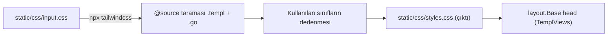

# StaticAssets

**Özet:** `static/` dizini tarayıcıya gönderilen statik varlıkları barındırır: Tailwind CSS ile derlenen stil dosyası ve iki istemci JS kütüphanesi (HTMX ve Alpine.js). CSS, Tailwind v4 `@source` direktifleriyle `.templ` ve `.go` kaynaklarını tarayarak sınıfları on-demand üretir; JS dosyaları CDN olarak indirilmiş minified kopyalardır.

**Kütüphaneler:** Tailwind CSS v4, HTMX, Alpine.js.

**Bağlantılar:** [[TemplViews]] · [[WebServer]] · [[DevTooling]] · [[Index]]

**Dosyalar:**
- `static/css/input.css` — Tailwind girişi ve `@source` tarama direktifleri
- `static/css/styles.css` — üretilen (derlenmiş) çıktı
- `static/js/htmx.min.js` — HTMX minified kopyası
- `static/js/cdn.min.js` — Alpine.js minified kopyası

## Geniş açıklama

### CSS akışı (Tailwind v4)

- `input.css` satır 1'de `@import "tailwindcss";` ile framework'ü yükler.
- `@source "../../**/*.templ"` ve `@source "../../**/*.go"` direktifleri, kök dizindeki template ve Go dosyalarını tarar; böylece yalnızca kodda gerçekten kullanılan utility sınıfları çıktıya dahil edilir (on-demand derleme).
- `styles.css` üretilmiş dosyadır; `Makefile`'daki `build` hedefi `--minify` ile üretir (bkz. [[DevTooling]]).

### JS varlıkları

- `static/js/htmx.min.js` → [[TemplViews]]'deki HTMX kartı için `hx-*` davranışlarını sağlar.
- `static/js/cdn.min.js` → Alpine.js dosyası; `x-data`, `@click`, `x-show` direktiflerini çalıştırır.
- Her ikisi `defer` ile `layout.Base` head bölümünden yüklenir; ayrı CDN çağrısı yoktur (offline geliştirme için yerel kopya).

### Servis

[[WebServer]] bu dizini `http.FileServer(http.Dir("./static"))` + `StripPrefix("/static/")` ile servis eder; tüm `href`/`src` referansları `/static/...` prefix'ini kullanır.

### Önemli noktalar

- `input.css` **kaynak**, `styles.css` **derlenmiş ürün**dür; sınıf eklemek için `.templ` dosyalarına yazmak yeterlidir (Tailwind taraması otomatik).
- Statik dosyalar `.air.toml` içinde `exclude_dir` listesindedir; yani hot-reload tetiklemezler (bkz. [[DevTooling]]).
