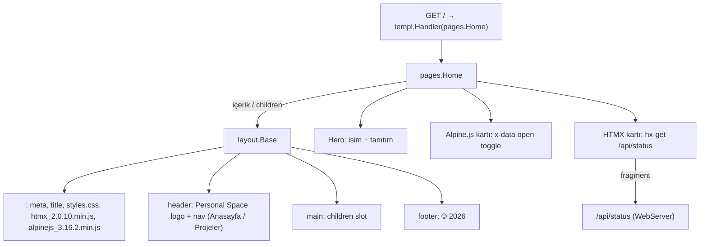

# TemplViews

**Özet:** `internal/views` paketi, templ ile yazılmış sunucu taraflı view katmanıdır. `layout.Base` tüm sayfaların ortak HTML iskeletini (head, header/nav, main, footer) sağlar; `pages.Home` ise anasayfa içeriğini üretir. Home, istemci etkileşimi için Alpine.js (`x-data`) ve HTMX (`hx-get`) örneklerini barındırır.

**Kütüphaneler:** `github.com/a-h/templ` (type-safe HTML template engine), Tailwind CSS sınıfları.

**Bağlantılar:** [[WebServer]] · [[StaticAssets]] · [[HTTPUtil]] · [[Index]]

**Dosyalar:**
- `internal/views/layout/base.templ` (+ üretilen `base_templ.go`)
- `internal/views/pages/home.templ` (+ üretilen `home_templ.go`)

## Geniş açıklama

View katmanı iki pakete ayrılmıştır: `layout` (ortak iskelet) ve `pages` (sayfa içerikleri). `.templ` dosyaları kaynak koddur; `.templ.go` dosyaları `templ generate` ile üretilir ve **elle düzenlenmemelidir** (bkz. [[DevTooling]]).

### Component hiyerarşisi

### layout.Base

- `Base(title string) templ.Component` → tek parametre alır, `<title>` etiketini besler.
- İçeriği `<main>` içindeki `children...` slot'una basar. Bu desen sayesinde her sayfa ortak iskeleti yeniden yazmaz.
- Footer ve header içinde sabit bağlantılar vardır: `/` (Anasayfa) ve `/projects` (Projeler). `/projects` için henüz route yok ([[WebServer]] notuna bakın).
- Statik bağımlılıklar: `/static/css/styles.css`, `/static/js/htmx_2.0.10.min.js`, `/static/js/alpinejs_3.16.2.min.js` (versiyonlu dosya adları, `defer` ile yüklenir; bkz. [[StaticAssets]]).

### pages.Home

- `Home(name string) templ.Component` → hero bölümünde gösterilen adı alır.
- **Alpine.js örneği:** `x-data="{ open: false }"` ile tarayıcı içi durum tutulur; buton `@click` ile toggle eder, `x-show` + `x-transition` kutusu görünürlüğü yönetir. Sunucuya hiç istek atılmaz.
- **HTMX örneği:** Buton `hx-get="/api/status"`, `hx-target="#status-box"`, `hx-swap="outerHTML"` ile sunucudan sadece HTML fragmenti çeker; tam sayfa yenilenmez.

### Önemli noktalar

- Türkçe içerik ve `lang="tr"` ile site tamamen Türkçe.
- Tailwind sınıfları doğrudan template içinde yazılır; derleme sırasında [[StaticAssets]]'teki `input.css` `@source` direktifleri `.templ` dosyalarını tarar.
- Home, `@layout.Base(...)` çağrısı içinde kendi içeriğini bir closure component olarak ileterek render eder.
