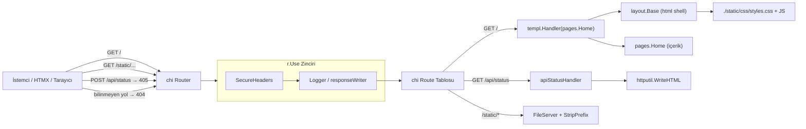

# WebServer

**Özet:** `cmd/web/main.go` uygulamanın tek giriş noktasıdır (delivery katmanı). `slog` üzerine renkli text handler kurar, **chi router** ile route'ları tanımlar ve tüm istekleri logging middleware'inden geçirir. `:8080` portunda timeout'ları tanımlı bir `http.Server` ile bloklanarak HTTP sunucusunu ayağa kaldırır.

**Kütüphaneler:** Go standard library (`net/http`, `log/slog`, `os`, `time`), `github.com/go-chi/chi/v5` (router + metot bazlı route), `github.com/lmittmann/tint` (renkli text handler), `github.com/a-h/templ` (templ component handler), `ozkansen.com/internal/httputil`.

**Bağlantılar:** [[SecureHeaders]] · [[LoggingMiddleware]] · [[TemplViews]] · [[StaticAssets]] · [[HTTPUtil]] · [[Linting]] · [[Index]]

**Dosyalar:**
- `cmd/web/main.go`

## Geniş açıklama

Uygulama, kişisel bir web sitesini sunan minimal bir Go web sunucusudur. Katman mantığı: giriş noktası → statik dosya sunucusu + route tanımları → middleware sarmalayıcı.

### Başlatma sırası

1. **Logger kurulumu:** `slog` default logger olarak `tint.NewTextHandler(os.Stdout, ...)` ile atanır. `LevelDebug` seviyesi ve `time.Kitchen` zaman formatı kullanılır; bu sayede geliştirme ortamında renkli, okunabilir loglar üretilir.
2. **Router:** `chi.NewRouter()` ile router oluşturulur (2026-08-22'de `http.ServeMux`'tan chi v5'e geçildi; gerekçe: metot bazlı route, otomatik 405/404 ve büyüme öngörüsü — bkz. [[Improvements]]).
3. **Middleware zinciri:** `r.Use(middleware.SecureHeaders)` (en dış — hata yanıtları dahil her yanıt güvenlik header'lı, bkz. [[SecureHeaders]]) + `r.Use(middleware.Logger(logger))`. stdlib uyumlu imzalar doğrudan Use ile takılır. **Kural:** chi'de tüm `Use` çağrıları route kayıtlarından önce yapılmalıdır, aksi halde süreç başlangıçta panikler.
4. **Statik dosyalar:** `./static` dizini `/static/*` altında servis edilir (`http.StripPrefix` ile prefix kırpılır).
5. **Sayfa route'u:** `/` → `r.Get("/", templ.Handler(pages.Home("Özkan")).ServeHTTP)` ile anasayfa render edilir.
6. **API route'u:** `/api/status` → HTMX istekleri için sadece bir HTML parçası (fragment) döner; tam sayfa render edilmez. Yanıt `httputil.WriteHTML(w, http.StatusOK, statusFragment)` ile yazılır (bkz. [[HTTPUtil]]). Route `r.Get` ile kayıtlı olduğundan diğer metotlara chi otomatik olarak `405 Method Not Allowed` + `Allow: GET` döner — eski handler içi guard bu sayede kaldırıldı.
7. **Sunucu:** `http.Server{Handler: r}` ile `ListenAndServe`. Timeout'lar: `ReadHeaderTimeout: 10s`, `ReadTimeout: 30s`, `WriteTimeout: 30s`, `IdleTimeout: 60s` (gosec G114 uyumlu).

### İstek akışı

### Önemli noktalar

- `/api/status` **fragment** döner (`div#status-box`), tam HTML değil. Bu, HTMX'in `hx-swap="outerHTML"` akışıyla uyumludur ve sayfa yenilenmeden güncelleme sağlar.
- **Metot kısıtı chi'nin işidir:** `r.Get` kaydı dışındaki metotlara otomatik `405 + Allow: GET` üretilir; handler içinde guard yoktur. Eski ServeMux'ta catch-all `/` bu davranışı bozuyordu (bkz. [[Improvements]] I3 ders notu).
- **404 semantiği değişti:** Eski catch-all `/` tüm bilinmeyen yollara anasayfayı 200 ile basardı; artık chi varsayılan NotFound handler'ı düz metin `404 page not found` döner. Markalı bir 404 sayfası istenirse `r.NotFound(...)` ile eklenebilir.
- Hata durumunda `logger.Error(...)` ile loglanır ve `os.Exit(1)` ile süreç sonlanır (eski `log.Fatal` yaklaşımı yerine default slog logger kullanılır).
- `Content-Type: text/html; charset=utf-8` header'ı API fragment için [[HTTPUtil]] içindeki `WriteHTML` tarafından set edilir.
- Yanıt yazma hataları handler'da değil, `WriteHTML` içinde merkezî olarak loglanır; bu, [[Linting]]'deki `errcheck` kuralının gereğini de karşılar.
- `http.Server` yapısı, `ReadHeaderTimeout` gibi alanlarla slowloris tarzı saldırılara karşı sınır koyar. Zaman aşımı değerleri `main.go` içinde sabittir.
