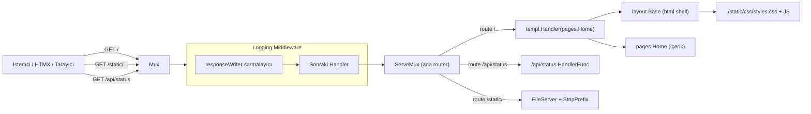

# WebServer

**Özet:** `cmd/web/main.go` uygulamanın tek giriş noktasıdır (delivery katmanı). `slog` üzerine renkli text handler kurar, `http.ServeMux` ile route'ları tanımlar ve tüm istekleri logging middleware zincirinden geçirir. `:8080` portunda timeout'ları tanımlı bir `http.Server` ile bloklanarak HTTP sunucusunu ayağa kaldırır.

**Kütüphaneler:** Go standard library (`net/http`, `log/slog`, `log`), `github.com/lmittmann/tint` (renkli text handler), `github.com/a-h/templ` (templ component handler).

**Bağlantılar:** [[LoggingMiddleware]] · [[TemplViews]] · [[StaticAssets]] · [[Linting]] · [[Index]]

**Dosyalar:**
- `cmd/web/main.go`

## Geniş açıklama

Uygulama, kişisel bir web sitesini sunan minimal bir Go web sunucusudur. Katman mantığı: giriş noktası → statik dosya sunucusu + route tanımları → middleware sarmalayıcı.

### Başlatma sırası

1. **Logger kurulumu:** `slog` default logger olarak `tint.NewTextHandler(os.Stdout, ...)` ile atanır. `LevelDebug` seviyesi ve `time.Kitchen` zaman formatı kullanılır; bu sayede geliştirme ortamında renkli, okunabilir loglar üretilir.
2. **Router:** `http.NewServeMux()` ile çoklayıcı oluşturulur.
3. **Statik dosyalar:** `./static` dizini `/static/` prefix'i altında servis edilir (`http.StripPrefix` ile prefix kırpılır).
4. **Sayfa route'u:** `/` → `templ.Handler(pages.Home("Özkan"))` ile anasayfa render edilir.
5. **API route'u:** `/api/status` → HTMX istekleri için sadece bir HTML parçası (fragment) döner; tam sayfa render edilmez. `w.Write` hatası `slog` ile loglanır (errcheck kuralı).
6. **Middleware zinciri:** `middleware.Logger(logger)` ile sarmalanan mux, `http.Server` yapısıyla `ListenAndServe` edilir.
7. **Sunucu timeout'ları:** `ReadHeaderTimeout: 10s`, `ReadTimeout: 30s`, `WriteTimeout: 30s`, `IdleTimeout: 60s` — `http.Server` struct'ı üzerinden tanımlanır (gosec G114 uyarısını giderir; bağlantı tabanlı saldırılara karşı koruma sağlar).

### İstek akışı

### Önemli noktalar

- `/api/status` **fragment** döner (`div#status-box`), tam HTML değil. Bu, HTMX'in `hx-swap="outerHTML"` akışıyla uyumludur ve sayfa yenilenmeden güncelleme sağlar.
- Route tanımları tüm istekleri kapsamaz: `/projects` linki header'da bulunur (bkz. [[TemplViews]]) ancak henüz bir handler tanımlanmamıştır, bu yüzden 404 döner.
- Hata durumunda `log.Fatal(err)` ile süreç sonlanır.
- `Content-Type: text/html` header'ı API fragment için açıkça set edilir.
- `w.Write` dönüş hatası yok sayılmaz; `logger.Error("Status yanıtı yazılamadı", ...)` ile loglanır. Bu, [[Linting]]'deki `errcheck` kuralının gereğidir.
- `http.Server` yapısı, `ReadHeaderTimeout` gibi alanlarla slowloris tarzı saldırılara karşı sınır koyar. Zaman aşımı değerleri `main.go` içinde sabittir.
